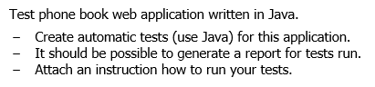

### Задание

### Сборка и запуск проекта

* Клонирование проекта

  `git clone https://github.com/ignal1/phonebook.git`

* Переход в директорию проекта

  `cd phonebook`

* Запуск API

  `java -jar phonebook.jar`
  
* В новом окне терминала, сборка и запуск проекта
  
  `./gradlew build`

При запуске проекта выполняются все тесты. Если сборка прошла успешно, значит тесты также успешно пройдены.

Отчет по тестам находится в директории проекта по пути: `build/reports/tests/test/index.html`

Для корректной работы приложения требуется JDK версии 8 или выше. 

Сейчас в проекте указана версия JDK 11. Если будет использоваться более низкая версия, нужно указать ее в параметре `sourceCompatibility` в файле `build.gradle`.

### Использованные технологии

* REST Assured

### API endpoints

`http://localhost:8080/phonebook-api.html` 